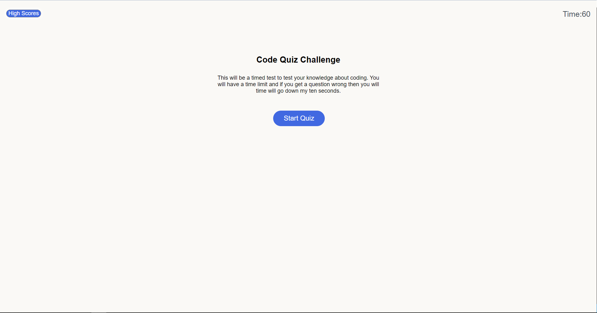
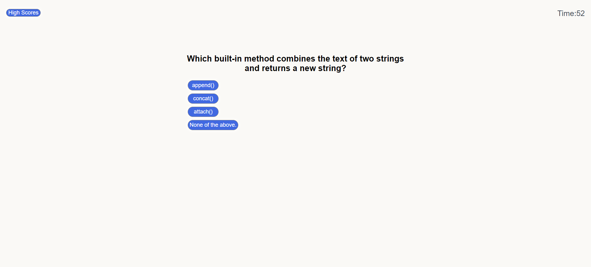
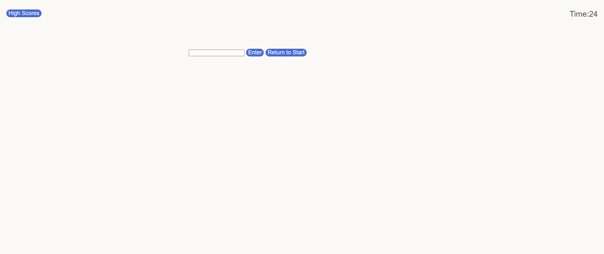
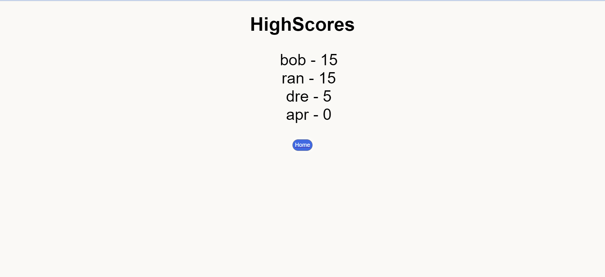

# Code-Quiz
[github link](https://github.com/Drewpayton/Homework-4)

[website quiz](https://drewpayton.github.io/Homework-4/)

# Description
This is a timed quiz about coding, you will go through a series of questions to see if you can get the highest
score on the quiz. I built this project to sharpen my javascript and jquery.

# Instructions

When you click the link this will pop up and whenever you are ready you will click start quiz.

Once you click start the first question will pop up and the timer will count down from a minute.  

If you finish or don't complete it within a minute then you will be taken to the end screen. This is where you put in your name to see on the highscores leaderboard if you got a high enough score

Lastly you can click the High Scores button and it will take you to the high scores. This is where you can see if your amongst the highest of scores.

